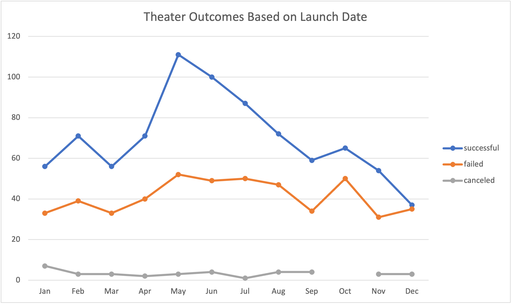
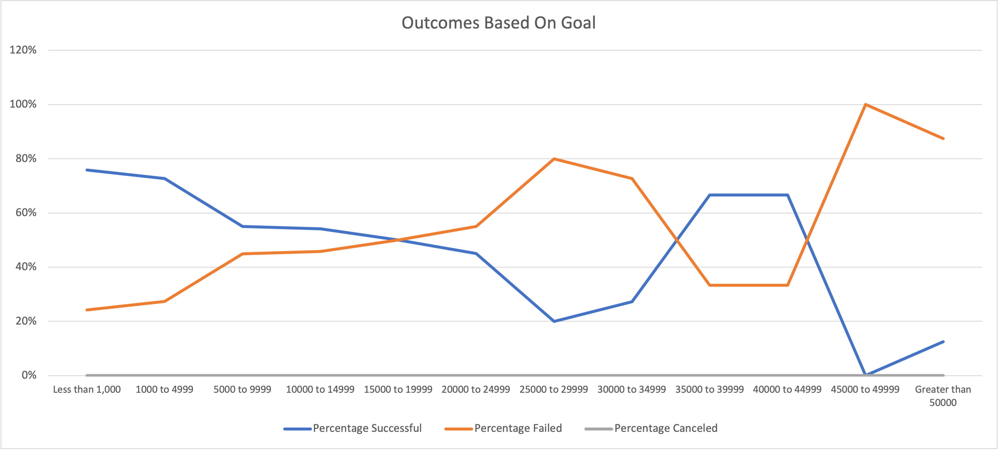

# Identifying What Makes a Play Successful on Kickstarter

## Overview of the Project
- The purpose of this project was to identify factors that make campaigns --  specifically plays in the United States -- successful on Kickstarter.  

## Analysis and Challenges
- To perform how the timing of a campaign determined its success, we used a simple Pivot Table to tabulate over 1,000 outcomes captured for theater data over the years. To determine how campaign goal affected success and fail rate, we counted the number of campaigns for each goal size using countif functions. We then did simple division to find the corresponding success/fail percentages for each outcome category.  

- During our goal analysis, our calculations were intially off because we didn’t write the countif functions correctly. At the beginning we used simple greater than or less than inequalities. By adding the equals sign (changing it to greater/less than or _equal_ to), we were able to capture all the data. 

## Results and Recommendations 
**Theater Outcomes by Launch Date**
- On average the months April to August had the highest raw number and percentage of successful theater campaigns.
- Fail and cancel rates stay relatively consistent, whereas the number of successful campaigns usually peaks in May and steadily decreases throughout the rest of the year.
- 

**Outcomes based on Goals**
- Across all fundraising goals, the campaigns with budgets less than $5000 (0-$1000, and $1000-$5000) were the most successful and reached their goal 76% and 73% of the time, respectively. 

Please note that expensive campaigns ($>10,000) are relatively uncommon and the success rate within these campaigns can range widely since the sample size is so small (roughly 90% of campaigns are less than <$10,000).

 
**Limitations of the Data Set** 

- One limitation of our analysis is that it includes outlier data (identified by the IQR rule). Exclusion of these campaigns decreases the mean and median by the following. 
<img src="https://user-images.githubusercontent.com/10199828/123544039-672ea400-d71f-11eb-8ef8-1b099065f33e.png" width="800"
- We decided to include outliers because they are representative of the wide variety of campaigns you will come across on Kickstarter. The theater play data set included very high standards of deviation, with nearly 70 successful campaigns and 30 failed campaigns having goals outside the IQR upper limit.

- Another limitation is that dataset itself cannot explain everything. For example, on average successful campaigns were plays with cheap budgets that hovered around $5,000. That being said, the median goal of *failed* plays was $5,000, which means that despite being relatively cheap, 50% of plays *still* failed. This implies that cost isn't everything, and that other factors were at play. It would be useful to conduct a qualitative analysis assessing the commonalities within successful plays (e.g. were the subject/plots similar?) or perhaps obtain more data that assessed other factors such as play time length, number of actors, and region/city of play. 

**Future Views**
- Additionally, it would be useful to create more graphs related to how average donation and number of backers within the different outcomes. 
- It could also be worth mapping how these trends over each year (instead of by month) for further insights. 

**Recommendations**
We recommend that Louise lower her budget closer to $3,000, which is the median goal of successful plays. She should also launch her campaign around May, the most successful months on Kickstarter. 

She should also keep in mind that cost isn't everything, and that there are other factors dictating a campaign's success. To further improve her understanding, she could do a qualitative analysis to see if successful plays have other attributes in common (e.g. such as subject matter or plot) or analyze other metrics such as average donation, number of backers, and breakdown of plays within city/region (Louise may have to find other data sources, as the Kickstarter data only provides the campaign's country). 
